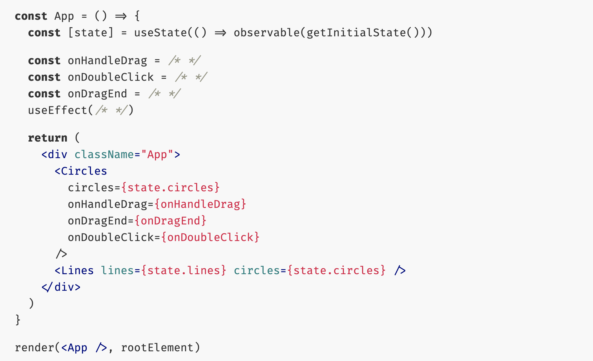

# Stuff

Just messing around 🤷‍♂️

I made this while bored. I was reading a presentation that had the following [slide, credit Michel Westrate talking about MobX](https://holyjs2019slides.surge.sh/#40)

This is my vision of what that would have potentially looked like visually (I didn't have video to the talk so I just thought something like this might be what it looks like 🤷‍♂️).

Then I went and started adding other random features.

## Screenshot

